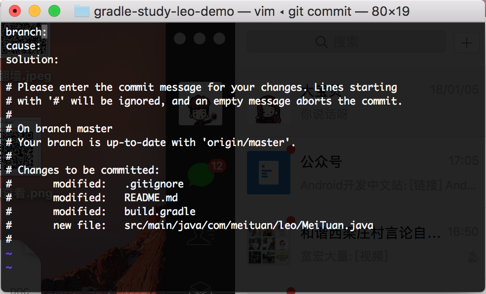
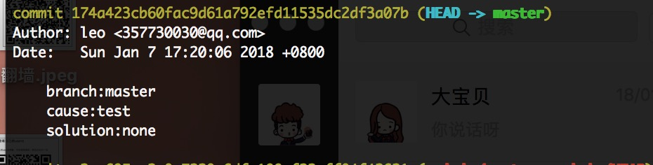

# Git提交格式

### 目的
* 在一些大厂多人开发的项目中，为了统一管理提交信息，以及为了以后爬取数据的方便，我们应该对提交的commit message进行格式统一。
* git commit message 的创建方式，下面我们给出了两种方式创建

### 方式
* 方式一：固定模版

  * 创建commit message template， 在根目录下创建.git_common_commit_template,
    * ```shell 
        vim .git_common_commit_template
      ```
  * 然后在vim编译器中键入模版 .wq保存
    * ```shell
        //键入模版
        branch:
        cause:
        solution:
        ```
  * 进入项目目录下，让git 使用模版  （路径与前面所保存的路径一致）
    * ```shell
        git config --local commit.template ~/.git_common_commit_template  
        ``` 
    
  * 提交commit测试
    * ```shell
         git add .
         git commit
        ```  
    * git commit 信息设置     <br /> 
    
    * git log 日志     <br /> 
    
    
* 方式二：通过pre-commit 动态设置commit信息（自动获取branch分支名）
  * 创建 .gitmessage文件，在根目录下在根目录下创建.gitmessage文件,同方式一中
    * ```shell
        touch ~/.gitmessage
        ```
  * 进入项目目录下，让git 使用模版  （路径与前面所保存的路径一致）或者打开.git/config vim配置
    * ```shell
        vim .git/config
               //在vim编辑器中最下面添加
            ……
        [commit]
                template = /Users/leo/.gitmessage
        ```
  
  * 使用git hook，在.git/hooks 目录下创建pre-commit，并在其中写入脚本
    * ```shell
        vim .git/hooks/pre-commit
        // 在pre-commit中写入脚本
        
        #!/bin/sh
        echo "id:$(git symbolic-ref --short HEAD | cut -d / -f2)" > ~/.gitmessage
         
        echo "cause:" >> ~/.gitmessage
         
        echo "solution:done" >> ~/.gitmessage
         
        ``` 
    * 切记：我们应该给 pre—commit配置权限,否则无法将无法执行pre-commit     <br />
      ```shell
        chmod 777 .git/hooks/pre-commit  (chmod +x .git/hooks/pre-commit)
      ```