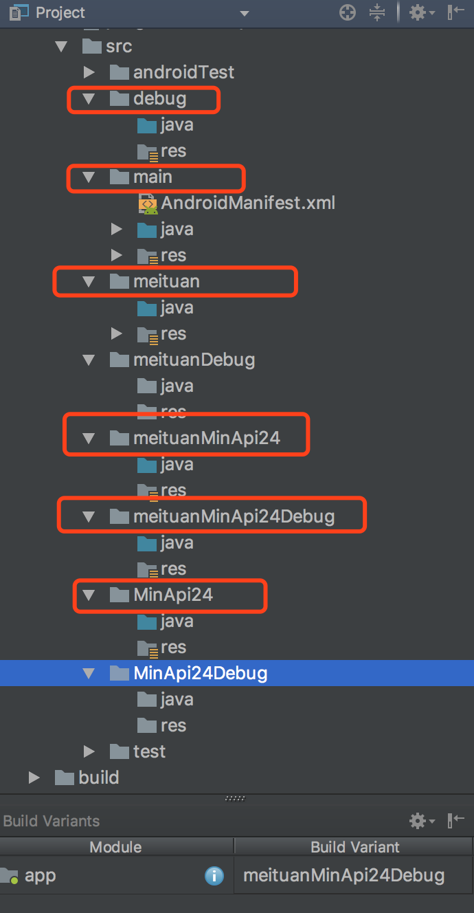

# Gradle构建流程

### 构建流程
* 编译器将您的源代码转换成 DEX（Dalvik Executable) 文件（其中包括运行在 Android 设备上的字节码），将所有其他内容转换成已编译资源
* APK 打包器将 DEX 文件和已编译资源合并成单个 APK。不过，必须先签署 APK，才能将应用安装并部署到 Android 设备上。
* APK 打包器使用调试或发布密钥库签署您的 APK：
  * 如果您构建的是调试版本的应用（即专用于测试和分析的应用），打包器会使用调试密钥库签署您的应用。Android Studio 自动使用调试密钥库配置新项目。
  * 如果您构建的是打算向外发布的发布版本应用，打包器会使用发布密钥库签署您的应用。
* 在生成最终 APK 之前，打包器会使用 zipalign 工具对应用进行优化，减少其在设备上运行时的内存占用

### 自定义构建配置
* 构建类型     <br />
  在android{}代码块中buildTypes{} ,android studio 会为我们自动的购进release和debug两种构建类型，我们也可以自己添加类型
  ```groovy
    buildTypes {
            release {
                minifyEnabled true
                proguardFiles getDefaultProguardFile('proguard-android.txt'), 'proguard-rules.pro'
            }
    
            debug {
              
            }
            test{
              //自定义的构建类型
            }
        }
    ```
* 产品风味     <br />
  我们可以在productFlavors {}中配置不同的产品风味，它于defaultConfig{}所支持的属性相同，defaultConfig中配置一些共有属性，在productFlavors{}中配置不同的属性
  ```groovy
      defaultConfig {
            applicationId "cog.leo"
            minSdkVersion 16 // app >= library 的 minSdkVersion
            targetSdkVersion 26
            versionCode 1
            versionName "1.0"
          }
      flavorDimensions "api", "mode"  
      
      productFlavors {
            meituan{
              dimension "mode"
            }
            dianping{
              dimension "mode"
            }
            minApi23{
              dimension "api"
              minSdkVersion 23
            }
            minApi24{
              dimension "api"
              minSdkVersion 24
            }
         }
    ```
   
* 构建变体 （构建类型和产品风味交叉产物）     <br />
   以上的代码将可以构建12中不同类型的构建变体    <br />
   构建变体：[minApi23,minApi24][meituan, meituan][release, debug,test]      <br />
   对应 APK：app-[minApi23, minApi24]-[meituan, meituan]-[release, debug,test].apk    <br />
   * 变体过滤器    <br />
     在构建变体过程中，有些变体是我们不需要的，我们可以在项目中过滤掉不需要的变体类型，移除某些构建变体配置 ，使用 variantFilter {}     <br />
     ```groovy
        android{
         buildTypes {}
         flavorDimensions "api" ,"mode"
         productFlavors{}
         variantFilter{
             variant ->
             def names = variant.flavors*.name
             if (names.contains("minApi23")&&names.contains("test")){
                 setIgnore(true)
             }
         }
        }
        ```
        在点击菜单栏中的 Build > Select Build Variant（或工具窗口栏中的 Build Variants）时，这些构建变体将不会再  显示在下拉菜单中
* 声明依赖项
  * 模块依赖项     <br />
    compile project(":meituan")
    ```groovy
        //setting.gradle
        include ':leo'
        project(':leo').projectDir = new File("./library")
        //build.gradle
        dependencies {
            compile fileTree(include: ['*.jar'], dir: 'libs')
            testCompile 'junit:junit:4.12'
            compile 'com.android.support:appcompat-v7:27.+'
            compile project(':leo')
        }
    
    ```
  * 远程二进制依赖项     <br />
    compile 'com.android.support:appcompat-v7:27.+'
  * 本地二进制依赖项      <br />
    compile fileTree(dir: 'libs', include: ['*.jar'])
    
  配置依赖项     <br />
  
  * compile 指定编译时依赖   meituanCompile  debugCompile    meituanDebugCompile
  * apk 指定gradle需要与apk打包的仅运行时依赖项
  * provided 指定gradle 不与apk打包的编译时依赖项
* 配置签署设置
  * 创建密钥库
  * 创建私钥
  * 将签署配置添加到模块级 build.gradle 文件中
  ```groovy
    //创建keystore.properties
    storePassword=""
    keyPassword=""
    keyAlias=""
    storeFile=/Users/leo/.android/debug.keystore
    
    //build.gradle
    def keyStore = rootProject.file("./keystore.properties")
    def keyStoreProperty = new Properties()
    keyStoreProperty.load(new FileInputStream(keyStore))
    android{
       signingConfigs {
              debug {
                  keyAlias keyStoreProperty['keyAlias']
                  keyPassword keyStoreProperty['keyPassword']
                  storePassword keyStoreProperty['storePassword']
                  storeFile file(keyStoreProperty['storeFile'])
              }
              release {
              }
       }
       buildTypes {
               release {
                   minifyEnabled false
                   proguardFiles getDefaultProguardFile('proguard-android.txt'), 'proguard-rules.pro'
               }
               debug {
                   signingConfig signingConfigs.debug
               }
       }    
    }
  
    ```
  上述中的keystore设置方式相对不安全，我们可以使用另外的方式
  * 通过环境变量获取这些密码
    ```groovy
        storePassword System.getenv("KSTOREPWD")
        keyPassword System.getenv("KEYPWD")
    ```
  * 通过命令行调用此构建时提示您输入这些密码
    ```groovy
        storePassword System.console().readLine("\nKeystore password: ")
        keyPassword System.console().readLine("\nKey password: ")
    ```  

### 源集

#### 创建源集
默认情况下，android studio 会为我们创建 main/源集和目录，用于存储所有构建变体之间共享的一切资源。然而，我们也可以创建新的源集来控制gradle为特定的构建类型和产品风味打包的确切文件     <br />
但是，main下面的目录结构需要我们保持  eg：src/java，src/res

* src/main/   此源集包括所有构建变体共用的代码和资源。
* src/debug/        创建此源集可加入特定构建类型专用的代码和资源。
* src/meituan/     创建此源集可加入特定产品风味专用的代码和资源。
* src/meituanDebug/    创建此源集可加入特定构建变体专用的代码和资源。

  * 编译的时候，构建系统需要合并来自以下源集的代码、设置和资源  （我们的项目中，main主源集和meituan或者dianping进行了合并）

  * 如果不同源集包含同一文件的不同版本，Gradle 将按以下优先顺序决定使用哪一个文件（左侧源集替换右侧源集的文件和设置）：

  * 构建变体（src/meituanDebug） > 构建类型(Debug) > 产品风味(meituan) > 主源集(main) > 库依赖项

    ```groovy
        compileSdkVersion 27
            buildToolsVersion "27.0.3"
        
            defaultConfig {
                applicationId "com.example.leo.leo"
                minSdkVersion 15
                targetSdkVersion 27
                versionCode 1
                versionName "1.0"
            }
            buildTypes {
                release {
                    minifyEnabled false
                    proguardFiles getDefaultProguardFile('proguard-android.txt'), 'proguard-rules.pro'
                }
                debug {
        
                }
            }
            flavorDimensions("nomal", "api")
            productFlavors {
                meituan {
                    dimension "nomal"
                }
                dianping {
                    dimension "nomal"
                }
                minApi23 {
                    minSdkVersion 23
                    dimension "api"
                }
                minApi24 {
                    minSdkVersion 24
                    dimension "api"
                }
        
            }
        
            variantFilter {
                variant ->
                    def names = variant.flavors*.name
                    if (names.contains("minApi23") || names.contains("dianping")) {
                        setIgnore(true)
                    }
            }
    ```
    构建变体生效图（构建类型和产品风味结合）  <br />
    
#### 源集配置更改
* 如果我们的源集未组织到gradle期望的源集目录下
    ```groovy
        sourceSets{
           main{
                    java.srcDirs = ['main2/java']
        
                    res.srcDirs = ['main2/res']
        
                    manifest.srcFile 'main2/AndroidManifest.xml'
                }
            }
    ```
    